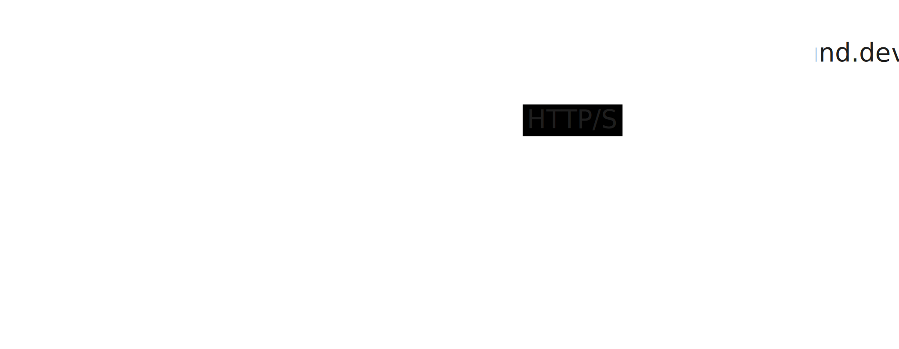

# hka_software_architecture_labor



## Local Setup

For local development, you can use the docker compose environment. It serves

- The API which is used for CORS-Proxy redirects.
- The Frontend Weather-App.

```sh
docker compose up -d
```

### Start the API manually for development

First you need to stop the docker container:

```sh
docker compose down api
```

The api can be run manually with the following commands

```sh
cd backend/api
npm i
npm run start:dev
```

### Start the Weather App manually for development

First you need to stop the docker container:

```sh
docker compose down weather-app
```

The weather-app can be run with the following commands

```sh
cd frontend/weather-app
npm i --force
npm run start
```